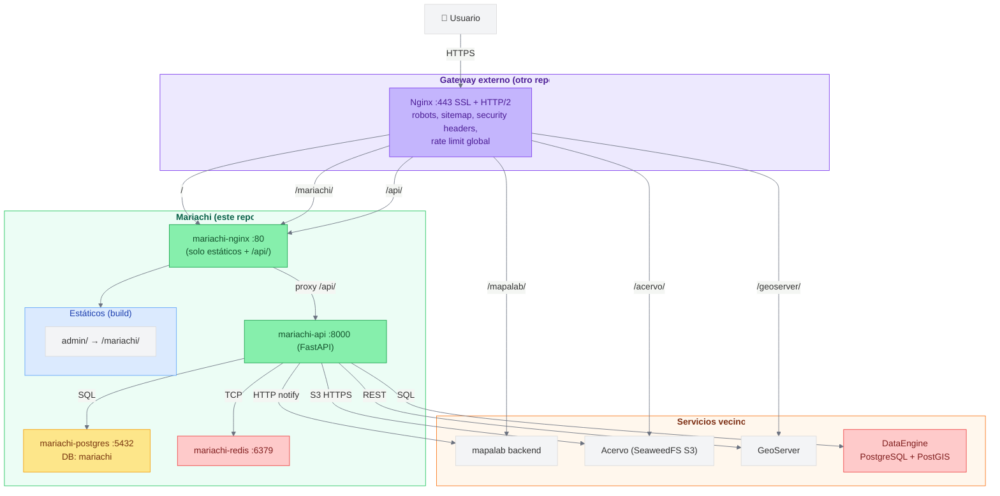

# Arquitectura de Mariachi

> Diagrama y composición del monorepo: stacks, red Docker, puertos, y cómo se conecta con el `gateway-hub` externo.

**Versión:** 0.30.5 · **Última actualización:** 2026-04-27

---

## Stack tecnológico

> El portal público (sitio web del IIEG) vive ahora en su propio repo: [`../portal`](../portal). Consume `/api/portal/*` de este `api`.

### CMS Admin (`admin/`)

| Tecnología | Versión | Uso |
|---|---|---|
| React | 19.2 | UI library |
| React Router | 7.13 | Routing / SPA |
| Vite | 7.3 | Build / dev server |
| Ant Design | 6.2 | Componentes del panel admin |
| @ant-design/icons | 6.1 | Iconografía |
| Axios | 1.13 | HTTP client |
| @dnd-kit | 6.3 / 10.0 | Drag & drop (árboles ordenables) |
| React GA4 | 2.1 | Google Analytics 4 |

### Backend (`api/`)

| Tecnología | Versión | Uso |
|---|---|---|
| Python | 3.12 | Runtime |
| FastAPI | 0.111–0.112 | Framework API |
| Uvicorn / Gunicorn | 0.23+ / 22+ | ASGI server |
| SQLAlchemy | 2.0 | ORM |
| Alembic | 1.13 | Migraciones (multi-env: `mariachi` + `dataengine`) |
| Pydantic / pydantic-settings | 2.5+ | Validación y configuración |
| python-jose | 3.3+ | JWT |
| passlib + bcrypt | 1.7+ / 3.2+ | Hashing de contraseñas |
| Redis (driver) | 5.0+ | Cache y sesiones |
| `minio` (paquete pip) | 7.2+ | Cliente S3-compatible para Acervo |
| httpx | 0.26+ | Cliente HTTP (GeoServer REST, notificaciones a mapalab) |
| psycopg2-binary | 2.9+ | Driver PostgreSQL |

### Dev / Testing

| Tecnología | Versión | Uso |
|---|---|---|
| ESLint | 9.39+ | Linter JS/JSX (admin + web) |
| Ruff | 0.3+ | Linter Python |
| Pytest | 8.0+ | Tests backend |
| pytest-asyncio | 0.23+ | Tests async |
| pytest-cov | 4.1+ | Cobertura |
| Mypy | 1.9+ | Type checking Python |

### Bases de datos

| Tecnología | Uso |
|---|---|
| PostgreSQL 16 (prod) / 18 (dev) | BD principal del CMS (`mariachi`) |
| PostgreSQL + PostGIS (externa, DataEngine) | Tablas `layers`, `workspaces`, `layer_metadata`, etc. del módulo de capas |

### Infraestructura

| Tecnología | Uso |
|---|---|
| Docker + Docker Compose | Orquestación. Dos archivos: `docker-compose.dev.yml` y `docker-compose.yml` (staging/prod) |
| Nginx Alpine | Servidor de estáticos + proxy a `/api/`. Se levanta en HTTP-only detrás del gateway externo |
| Make | Automatización (`make up [ENV=dev\|staging\|prod]`) |

---

## Modelo de despliegue

Mariachi no expone puertos al host en staging/prod. Todo el tráfico externo llega al `gateway-hub` (otro repo, Nginx arriba de todos los servicios) y entra a mariachi por la red Docker externa `iieg-network` usando el nombre de servicio `mariachi-nginx:80`.

El gateway externo resuelve:

- Terminación SSL / HTTP-2.
- Redirect `80 → 443`.
- `robots.txt`, `sitemap.xml` y control de `SEO_ENABLED` por entorno.
- Headers de seguridad (HSTS, X-Frame-Options, CSP, etc.).
- Proxies a `/mapalab/`, `/acervo/`, `/geoserver/` (servicios vecinos).

El nginx interno de mariachi solo sirve los estáticos de `admin/` (en `/mariachi/`) y hace proxy a `/api/`. La raíz (`/`) redirige a `/mariachi/`. No monta certificados SSL ni maneja redirects globales.

---

## Diagrama



---

## Estructura del monorepo

```
mariachi/
├── api/                              # Backend FastAPI
│   ├── app/
│   │   ├── main.py                   # create_app
│   │   ├── api/
│   │   │   ├── deps.py               # get_current_user, verify_csrf, require_role
│   │   │   ├── rate_limit.py         # Sliding window en Redis (multi-worker safe)
│   │   │   └── routes/               # auth, users, pages, menu, media, borradores,
│   │   │                             # layers, layer_metadata, geoserver, preview, public,
│   │   │                             # formularios/ (modulo sieej, ver docs/sieej.md)
│   │   ├── core/
│   │   │   ├── settings.py           # Pydantic settings + bifurcación por ENVIRONMENT
│   │   │   ├── database.py           # engine principal + get_dataengine_db (lazy)
│   │   │   ├── security.py           # JWT + CSRF
│   │   │   ├── time.py               # utcnow helper (timezone-naive)
│   │   │   └── optimistic.py         # check_concurrent_edit (HTTP 409 por updated_at)
│   │   ├── models/                   # user, page, menu_item, media, borrador, layer*,
│   │   │                             # sieej/ (schema sieej, 12 tablas)
│   │   ├── schemas/                  # Pydantic request/response (incl. schemas/sieej/)
│   │   └── services/                 # acervo, geoserver_client, layer_service,
│   │                                 # mapalab_notifier (X-Internal-Token desde 1.0.3),
│   │                                 # mapalab_public_cache, mapalab_shares,
│   │                                 # stats_templates, slug_service, presence,
│   │                                 # borrador_service, media_service, menu_tree,
│   │                                 # sieej/ (general, enlace, bases_datos)
│   ├── alembic/
│   │   ├── versions/mariachi/        # Migraciones de mariachi
│   │   └── versions/dataengine/      # Migraciones del schema mapalab en DataEngine
│   ├── scripts/                      # init_db, seed_layers, migrate_mapalab_card
│   └── tests/
│
├── admin/                            # CMS (Ant Design)
│   └── src/
│       ├── main.jsx
│       ├── pages/                    # Login, PageEditor, MenuManager, Media,
│       │                             # RevisionQueue, Users, MapalabLayers
│       ├── components/
│       │   ├── MainLayout.jsx        # Menú lateral (Portalito + Mapalab)
│       │   └── layersEditor/         # Drawers y JSON editor para capas
│       ├── hooks/                    # useLayerTreeAdmin, etc.
│       ├── contexts/                 # AuthContext
│       └── services/                 # apiService con CSRF
│
├── nginx/                            # Proxy HTTP-only interno
│   ├── nginx.conf
│   ├── conf.d/mariachi.conf          # listen 80, /api/ proxy, estáticos admin/web
│   └── Dockerfile                    # multi-stage: web-builder + admin-builder + nginx
│
├── scripts/                          # Scripts de gestión
│   ├── migrate-acervo-bucket.sh
│   └── rename-github-repo.sh
│
├── docs/                             # Esta documentación
├── .github/workflows/                # CI/CD (commit-lint, ci, cd, auto-merge, test-backend, test-frontend)
├── docker-compose.yml                # staging / producción
├── docker-compose.dev.yml            # desarrollo local
├── Makefile
├── .env.development.example
├── .env.staging.example
├── .env.production.example
└── CHANGELOG.md
```

---

## Red Docker

| Red | Tipo | Servicios | Propósito |
|---|---|---|---|
| `mariachi_network` | Bridge interna (este repo) | `api`, `postgres`, `redis`, `nginx` | Comunicación intra-mariachi |
| `iieg-network` | External (compartida) | `nginx` + `api` también se conectan | Interop con gateway-hub y servicios vecinos (mapalab, acervo, geoserver, dataengine) |

En dev (`docker-compose.dev.yml`) no existe `nginx` — los frontends corren directo en Vite (3010/3011), el API en 8000, y no se necesita `iieg-network`.

---

## Puertos

| Servicio | Dev | Staging / Prod |
|---|---|---|
| `web` (Vite) | 3010 | — (servido como estático por nginx) |
| `admin` (Vite) | 3011 | — (servido como estático por nginx) |
| `api` | 8000 | interno (via proxy de nginx) |
| `nginx` | — | `expose: 80` en `iieg-network`, sin puertos al host |
| `postgres` | 5432 | interno |
| `redis` | 6379 | interno |

---

## Documentación relacionada

- [context](./context.md) — referencia completa del monorepo
- [DATAENGINE_CREDENTIALS](./DATAENGINE_CREDENTIALS.md) — provisioning del rol para DataEngine
- [ALEMBIC_MULTI_ENV](./ALEMBIC_MULTI_ENV.md) — migraciones multi-BD
- [COOKIES_CSRF](./COOKIES_CSRF.md) — modelo de seguridad
- [DRAFTS](./DRAFTS.md) — borradores y revision queue
- [sieej](./sieej.md) — modulo SIEEJ: schema, endpoints `/formularios/*`, integracion con frontend `iieg-oficial/sieej`
- [ROLES](./ROLES.md) — matriz de roles globales (tetlamamakani, editora, externo) y autorizacion por proyecto
