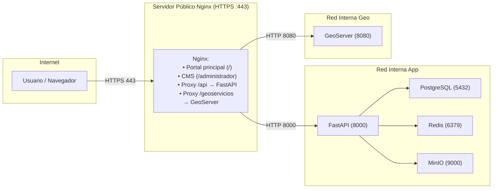

# Arquitectura del Portal IIEG

## Stack Tecnológico

| Componente | Tecnología |
|------------|------------|
| **Frontend** | React 19 + Vite 7 + Tailwind CSS 4 |
| **CMS** | React 19 + Vite 7 + Ant Design 5 |
| **Backend** | FastAPI + SQLAlchemy 2 + Pydantic 2 |
| **Base de Datos** | PostgreSQL 16 |
| **Cache** | Redis 7 |
| **Object Storage** | MinIO (S3-compatible) |
| **Contenedores** | Docker + Docker Compose |

## Diagrama de Arquitectura



## Estructura del Monorepo

```
portal/
├── backend/              # API FastAPI
│   ├── app/
│   │   ├── api/routes/   # Endpoints
│   │   ├── core/         # Config, security, database
│   │   ├── models/       # SQLAlchemy models
│   │   ├── schemas/      # Pydantic schemas
│   │   └── services/     # Business logic
│   ├── alembic/          # Migraciones DB
│   └── scripts/          # Scripts de utilidad
│
├── frontend/             # Portal público (React)
│   └── frontend/
│       ├── src/
│       │   ├── components/
│       │   ├── pages/
│       │   ├── hooks/
│       │   ├── services/
│       │   └── contexts/
│       └── public/
│
├── cms/                  # CMS Admin (React + Ant Design)
│   └── frontend/
│       ├── src/
│       │   ├── components/
│       │   ├── pages/
│       │   ├── hooks/
│       │   ├── services/
│       │   └── contexts/
│       └── public/
│
└── docs/                 # Documentación adicional
```

## Flujos de Trabajo

### Desarrollo Local

```bash
# Levantar servicios de infraestructura
docker compose -f docker-compose.dev.yml up postgres redis minio -d

# Backend
cd backend && uvicorn app.main:app --reload --port 8000

# Frontend (puerto 3010)
cd frontend && npm run dev

# CMS (puerto 3011)
cd cms && npm run dev
```

### Producción

```bash
docker compose up -d
```

## Puertos

| Servicio | Desarrollo | Producción |
|----------|------------|------------|
| Frontend | 3010 | 80 (nginx) |
| CMS | 3011 | 80 (nginx) |
| Backend | 8000 | 8000 |
| PostgreSQL | 5432 | 5432 |
| Redis | 6379 | 6379 |
| MinIO API | 9000 | 9000 |
| MinIO Console | 9001 | 9001 |

## Documentación Adicional

- [Conexión Frontend-Backend](./FRONTEND_CONNECTION.md)
- [Cookies y CSRF](./COOKIES_CSRF.md)
