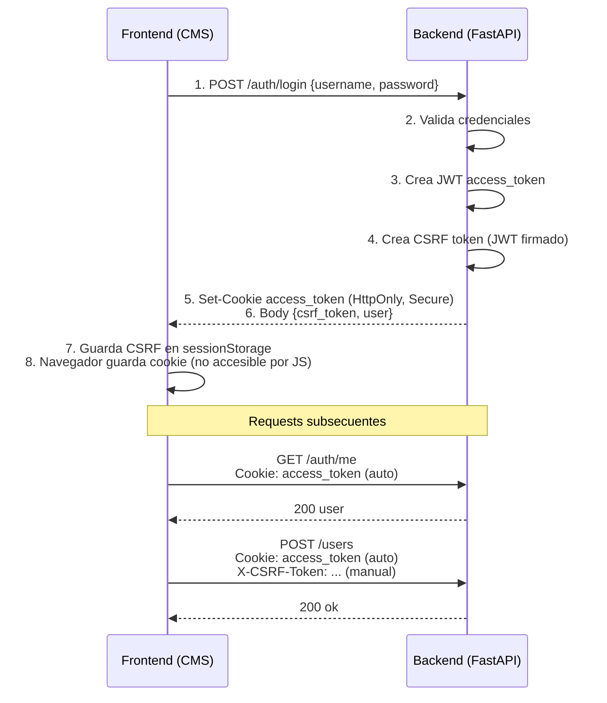
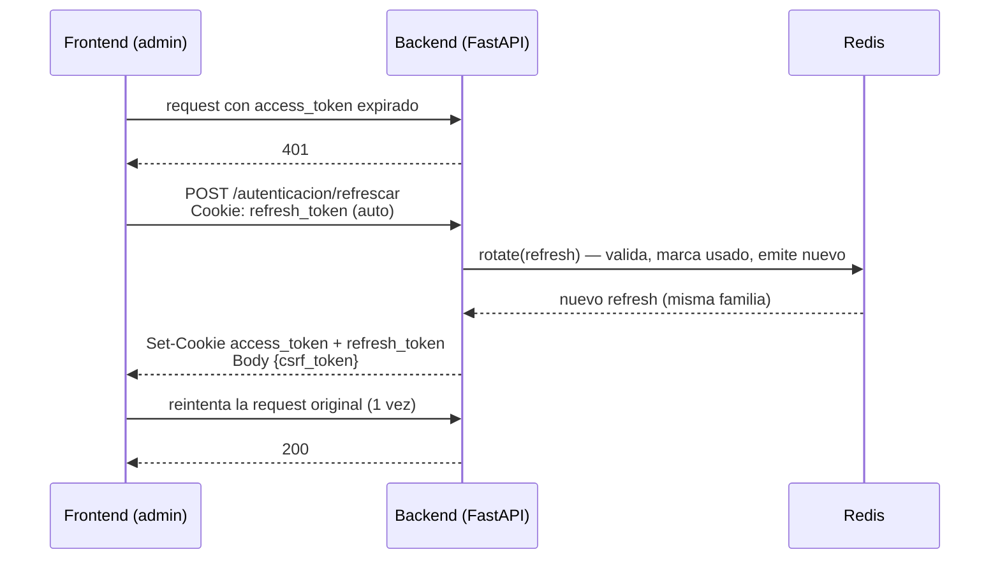

# Autenticación con httpOnly Cookies + CSRF

> Guía completa del sistema de autenticación con cookies `HttpOnly` + tokens CSRF firmados + refresh token rotativo.

**Versión:** 1.89.5 · **Última actualización:** 2026-07-27

> **Nota:** desde `1.73.0` la sesión ya no es un tope fijo de 30 min. Ver [Refresh Token (renovación de sesión)](#refresh-token-renovación-de-sesión) más abajo.
>
> Renovar la sesión es **responsabilidad de cada frontend** que consuma `/api/mariachi`, no solo del panel: ver [Renovación desde otros frontends del ecosistema](#renovación-desde-otros-frontends-del-ecosistema).

---

## ¿Por Qué httpOnly Cookies + CSRF?

### Ventajas sobre localStorage + JWT

| Aspecto | localStorage + JWT | httpOnly Cookies + CSRF |
|---------|-------------------|-------------------------|
| **Protección XSS** | Vulnerable | Protegido |
| **Protección CSRF** | Inmune | Protegido con token |
| **JavaScript Access** | Accesible | NO accesible |
| **Auto-manejo** | Manual | Automático por navegador |
| **Seguridad** | Media | Alta |

### Amenazas que Previene

**XSS (Cross-Site Scripting):**
- Con localStorage: Si un atacante inyecta JavaScript, puede robar el token
- Con httpOnly cookies: JavaScript NO puede acceder a la cookie

**CSRF (Cross-Site Request Forgery):**
- Cookies se envían automáticamente → Necesitamos CSRF token para validar
- CSRF token es único por sesión y se verifica en cada request mutable

---

## Arquitectura del Sistema



---

## Refresh Token (renovación de sesión)

> Desde **1.73.0**. Antes la sesión era un tope fijo de 30 min desde el login, sin renovación: el JWT de acceso se emitía solo al iniciar sesión y nadie lo reemitía, así que a los 30 min exactos el backend respondía `401` y el interceptor mandaba a `/login` aunque estuvieras trabajando.

### Modelo de dos cookies

| Cookie | Contenido | Vida | Uso |
|--------|-----------|------|-----|
| `access_token` | JWT firmado (`HS256`) | corta (30 min) | se envía en **cada** request; valida la sesión |
| `refresh_token` | opaco aleatorio (`token_urlsafe(32)`) | **8 h deslizantes** de inactividad | solo lo usa `POST /autenticacion/refrescar` para emitir un access nuevo |

Ambas son `HttpOnly` (no accesibles por JavaScript). Mientras uses el panel, el front renueva el access en silencio contra el refresh; **solo te saca tras 8 h sin actividad**.

### Rotación + detección de reúso (Redis)

El refresh **no** vive en un JWT ni en Postgres: se guarda **hasheado (SHA-256)** en Redis, agrupado por *familia* (`app/core/refresh_token.py`).

| Llave Redis | Valor | TTL |
|-------------|-------|-----|
| `rt:tok:{sha256}` | `{u: username, f: family, used: bool}` | 8 h |
| `rt:fam:{family}` | set de hashes de la familia | 8 h |
| `rt:user:{username}` | set de familias del usuario | 8 h |

- **Rotación**: cada llamada a `/refrescar` marca el token actual como `used`, emite uno nuevo en la misma familia y **refresca los TTL a 8 h** (de ahí lo "deslizante").
- **Detección de reúso**: si llega un refresh ya rotado (`used=True`) — posible robo — se **revoca toda la familia** y se rechaza con `401`.
- `cerrar-sesion` revoca la familia del refresh presentado; `cambiar-contrasena` revoca **todas** las familias del usuario (`revoke_user`) para que un refresh robado no pueda emitir accesos que evadan la invalidación por cambio de contraseña.

### Flujo de renovación



El interceptor de `admin/src/shared/services/api.js` dedup­lica las renovaciones concurrentes con una promesa única y solo reintenta **una vez**; si el refresh falla, cae al flujo actual de redirección a `/login`.

### Renovación desde otros frontends del ecosistema

`/api/mariachi` no lo consume solo el panel: SIEEJ (y cualquier front que se le sume) usa las mismas cookies contra el mismo backend. **Renovar la sesión es responsabilidad del cliente**, y un front que no llame a `/refrescar` manda al login a los 30 min aunque el refresh siga vigente — que es exactamente lo que le pasó a SIEEJ hasta `sieej 1.47.1`, con el refresh de 8 h funcionando del lado del backend desde 1.73.0.

Lo que tiene que hacer todo consumidor:

1. Ante un `401`, llamar a `POST /autenticacion/refrescar` y **reintentar la petición una vez** antes de limpiar la sesión. Excluir los propios endpoints de auth para no ciclar.
2. Hacer lo mismo en la comprobación de sesión del arranque, o recargar la pestaña con el access expirado cae al login.
3. Pasar **todas** las peticiones por ese cliente. Un `fetch` suelto (una descarga de PDF, por ejemplo) se salta el interceptor y falla con la sesión expirada en vez de renovar.

**Coordinación entre pestañas.** Los fronts se sirven desde el mismo origen, así que comparten la cookie: dos pestañas cuyo access expira a la vez presentan el **mismo** refresh token, una rota bien y la otra cae en la detección de reúso, que revoca la familia y saca a las dos. La renovación se serializa con `navigator.locks` —el lock es por origen, así que cruza pestañas y apps— más una marca en `localStorage` (`auth_refreshed_at`): quien entra al lock y ve una renovación de hace menos de 10 s reutiliza la cookie nueva en lugar de rotar otra vez. Vive en `admin/src/shared/utils/sessionRefresh.js` y su gemelo `frontend/src/helpers/sessionRefresh.js` en SIEEJ.

> La alternativa del lado del servidor sería una **ventana de gracia** en `rotate()`: aceptar el token ya usado durante N segundos devolviendo un sucesor en la misma familia, en vez de revocar. No está implementada — implicaría relajar `test_refrescar_rotacion_detecta_reuso` — y la coordinación se resuelve hoy en el cliente.

### Endpoint

```python
@router.post(
    "/refrescar",
    dependencies=[Depends(rate_limit_ip(max_requests=30, window_seconds=60, scope='refresh'))],
)
async def refrescar_sesion(response, db, refresh_cookie=Cookie(alias=settings.refresh_cookie_name)):
    if not refresh_cookie:
        _clear_session_cookies(response); raise HTTPException(401, "Sesión expirada")
    try:
        new_raw, username = refresh_token.rotate(refresh_cookie)
    except refresh_token.RefreshError as exc:
        _clear_session_cookies(response); raise HTTPException(401, str(exc))
    # ... valida usuario, set access + refresh cookies, devuelve csrf_token nuevo
```

No exige `X-CSRF-Token`: la posesión de la cookie `refresh_token` (`HttpOnly` + `SameSite`) es la prueba, y la CSRF pudo haber expirado (60 min) antes que la sesión.

**Limitación conocida**: el access token sigue siendo JWT stateless; `cerrar-sesion` revoca el refresh pero el access vigente muere por su propio TTL (≤30 min) — no hay blacklist por `jti`.

---

## Configuración Backend

### 1. Variables de Entorno (`.env`)

```bash
# JWT Access Token
SECRET_KEY=your-secret-key-here
ALGORITHM=HS256
ACCESS_TOKEN_EXPIRE_MINUTES=30

# Cookies httpOnly
COOKIE_NAME=access_token
COOKIE_MAX_AGE=1800
COOKIE_DOMAIN=
COOKIE_SECURE=false
COOKIE_HTTPONLY=true
COOKIE_SAMESITE=lax

# Refresh Token (renovación de sesión; ventana de inactividad)
# El max_age de la cookie refresh_token se DERIVA de esta variable (× 60 s).
REFRESH_TOKEN_EXPIRE_MINUTES=480

# CSRF Token
CSRF_SECRET_KEY=your-csrf-secret-key
CSRF_TOKEN_EXPIRE_MINUTES=60

# CORS (REQUERIDO para cookies)
CORS_ORIGINS=["http://localhost:3011","http://localhost:3010"]
```

### 2. Settings (`app/core/settings.py`)

```python
class Settings(BaseSettings):
    cookie_name: str = Field(default="access_token")
    cookie_max_age: int = Field(default=1800)
    cookie_httponly: bool = Field(default=True)
    cookie_secure: bool = Field(default=False)
    cookie_samesite: str = Field(default="lax")

    csrf_secret_key: str
    csrf_token_expire_minutes: int = Field(default=60)
```

### 3. Security Functions (`app/core/security.py`)

```python
def crear_csrf_token(username: str) -> str:
    data = {
        "sub": username,
        "type": "csrf",
        "random": secrets.token_urlsafe(32),
        "exp": datetime.utcnow() + timedelta(minutes=settings.csrf_token_expire_minutes),
    }
    return jwt.encode(data, settings.csrf_secret_key, algorithm=settings.algorithm)

def verificar_csrf_token(token: str, username: str) -> bool:
    try:
        payload = jwt.decode(token, settings.csrf_secret_key, algorithms=[settings.algorithm])
        return payload.get("sub") == username and payload.get("type") == "csrf"
    except JWTError:
        return False
```

### 4. Dependencies (`app/api/deps.py`)

```python
async def get_current_user(
    request: Request,
    access_token: str | None = Cookie(default=None, alias=settings.cookie_name),
    db: Session = Depends(get_db),
) -> Usuario:
    if access_token is None:
        raise HTTPException(status_code=401, detail="No autenticado")

    payload = decodificar_token(access_token)
    username = payload.get("sub")
    return db.query(Usuario).filter(Usuario.username == username).first()

async def verify_csrf(
    request: Request,
    current_user: Usuario = Depends(get_current_user),
):
    if request.method in ["POST", "PUT", "DELETE", "PATCH"]:
        csrf_token = request.headers.get("X-CSRF-Token")
        if not csrf_token or not verificar_csrf_token(csrf_token, current_user.username):
            raise HTTPException(status_code=403, detail="CSRF token inválido")
    return current_user
```

### 5. Login Endpoint (`app/api/routes/auth.py`)

```python
@router.post("/login", response_model=LoginResponse)
async def login(
    credentials: LoginRequest,
    response: Response,
    db: Session = Depends(get_db),
):
    usuario = db.query(Usuario).filter(Usuario.username == credentials.username).first()

    if not usuario or not verificar_password(credentials.password, usuario.hashed_password):
        raise HTTPException(status_code=401, detail="Credenciales inválidas")

    access_token = crear_access_token(data={"sub": usuario.username})

    response.set_cookie(
        key=settings.cookie_name,
        value=access_token,
        max_age=settings.cookie_max_age,
        httponly=settings.cookie_httponly,
        secure=settings.cookie_secure,
        samesite=settings.cookie_samesite,
    )

    csrf_token = crear_csrf_token(usuario.username)

    return LoginResponse(csrf_token=csrf_token, user=UsuarioResponse.model_validate(usuario))
```

### 6. Logout Endpoint

```python
@router.post("/logout")
async def logout(
    response: Response,
    current_user: Usuario = Depends(get_current_user),
):
    response.delete_cookie(
        key=settings.cookie_name,
        httponly=settings.cookie_httponly,
        secure=settings.cookie_secure,
        samesite=settings.cookie_samesite,
    )
    return {"message": "Sesión cerrada"}
```

### 7. CORS Configuration (`app/main.py`)

```python
app.add_middleware(
    CORSMiddleware,
    allow_origins=settings.cors_origins,
    allow_credentials=True,
    allow_methods=["*"],
    allow_headers=["*"],
)
```

---

## Configuración Frontend (CMS Portal)

### 1. API Service (`admin/src/services/api.js`)

```javascript
import axios from 'axios';

const API_URL = import.meta.env.VITE_API_URL || 'http://localhost:8000/api/administrador';

const api = axios.create({
    baseURL: API_URL,
    timeout: 10000,
    withCredentials: true,
    headers: {
        'Content-Type': 'application/json',
    }
});

api.interceptors.request.use(
    (config) => {
        if (['post', 'put', 'delete', 'patch'].includes(config.method?.toLowerCase())) {
            const csrfToken = sessionStorage.getItem('csrf_token');
            if (csrfToken) {
                config.headers['X-CSRF-Token'] = csrfToken;
            }
        }
        return config;
    },
    (error) => Promise.reject(error)
);

api.interceptors.response.use(
    (response) => response,
    (error) => {
        if (error.response?.status === 401) {
            sessionStorage.removeItem('csrf_token');
            window.location.href = '/login';
        }
        return Promise.reject(error);
    }
);

export default api;
```

### 2. Auth Context (`admin/src/contexts/AuthContext.jsx`)

```javascript
const login = async (username, password) => {
    const response = await api.post('/auth/login', { username, password });

    const { csrf_token, user } = response.data;

    sessionStorage.setItem('csrf_token', csrf_token);
    setUser(user);

    return response.data;
};

const logout = async () => {
    try {
        await api.post('/auth/logout');
    } finally {
        sessionStorage.removeItem('csrf_token');
        setUser(null);
    }
};

const checkAuth = async () => {
    try {
        const response = await api.get('/auth/me');
        setUser(response.data);
    } catch (error) {
        setUser(null);
    }
};
```

---

## Flujo Detallado

### Login

```
1. Usuario ingresa credenciales
   ↓
2. Frontend: POST /auth/login
   Body: {username: "admin", password: "admin123"}
   ↓
3. Backend valida credenciales
   ↓
4. Backend crea JWT access_token
   Token contiene: {sub: "admin", exp: 1234567890}
   ↓
5. Backend crea CSRF token
   Token contiene: {sub: "admin", type: "csrf", random: "...", exp: 1234567890}
   ↓
6. Backend establece cookie httpOnly
   Set-Cookie: access_token=eyJhbGc...; HttpOnly; Secure; SameSite=lax
   ↓
7. Backend responde
   Body: {csrf_token: "eyJhbGc...", user: {...}}
   ↓
8. Frontend guarda CSRF en sessionStorage
   sessionStorage.setItem('csrf_token', csrf_token)
   ↓
9. Navegador guarda cookie automáticamente
   Cookie NO accesible por JavaScript (httpOnly)
```

### Request GET (Solo lectura)

```
1. Frontend: GET /auth/me
   Cookie: access_token=eyJhbGc... (automático)
   ↓
2. Backend lee cookie desde request
   ↓
3. Backend valida JWT token
   ↓
4. Backend responde con datos
```

### Request POST/PUT/DELETE (Mutable)

```
1. Frontend: POST /users
   Cookie: access_token=eyJhbGc... (automático)
   X-CSRF-Token: eyJhbGc... (manual desde sessionStorage)
   Body: {username: "nuevo", ...}
   ↓
2. Backend lee cookie Y header CSRF
   ↓
3. Backend valida JWT token (autenticación)
   ↓
4. Backend valida CSRF token (protección CSRF)
   ↓
5. Backend procesa request y responde
```

### Logout

```
1. Frontend: POST /auth/logout
   Cookie: access_token=eyJhbGc...
   X-CSRF-Token: eyJhbGc...
   ↓
2. Backend elimina cookie
   Set-Cookie: access_token=; Max-Age=0
   ↓
3. Frontend elimina CSRF de sessionStorage
   sessionStorage.removeItem('csrf_token')
   ↓
4. Usuario redireccionado a /login
```

---

## Seguridad

### Flags de Cookie

```
access_token=eyJhbGc...;
  HttpOnly;              ← NO accesible por JavaScript
  Secure;                ← Solo HTTPS (producción)
  SameSite=lax;          ← Protección CSRF básica
  Max-Age=1800;          ← 30 minutos
  Domain=.iieg.gob.mx;   ← Compartir entre subdominios
  Path=/;                ← Disponible en todo el sitio
```

### CSRF Token

- **Generación:** JWT firmado con `CSRF_SECRET_KEY` (diferente a `SECRET_KEY`)
- **Contenido:** `{sub: username, type: "csrf", random: "...", exp: timestamp}`
- **Almacenamiento:** sessionStorage (se pierde al cerrar pestaña)
- **Verificación:** Se valida en requests POST/PUT/DELETE/PATCH
- **Binding:** Token vinculado al username (no se puede usar con otra sesión)

### Consideraciones de Seguridad

**httpOnly = true:** Previene XSS
**Secure = true (prod):** Solo HTTPS
**SameSite = lax:** Previene CSRF básico
**CSRF token:** Previene CSRF avanzado
**Tokens separados:** JWT para auth, CSRF para validación
**Expiración:** Tokens expiran automáticamente
**CORS estricto:** Solo dominios permitidos

---

## Testing

### Probar Login

```bash
# 1. Login y ver cookie en respuesta
curl -v -X POST http://localhost:8000/api/administrador/auth/login \
  -H "Content-Type: application/json" \
  -d '{"username":"admin","password":"admin123"}' \
  --cookie-jar cookies.txt

# Buscar en output:
# Set-Cookie: access_token=eyJhbGc...; HttpOnly; Path=/; SameSite=lax

# 2. Usar cookie en request subsecuente
curl http://localhost:8000/api/administrador/auth/me \
  --cookie cookies.txt

# 3. Probar con CSRF
curl -X POST http://localhost:8000/api/administrador/users \
  --cookie cookies.txt \
  -H "X-CSRF-Token: <csrf-token-from-login>" \
  -H "Content-Type: application/json" \
  -d '{"username":"test","email":"test@test.com","name":"Test","password":"test1234","role":"editora"}'
```

### Probar en Navegador (DevTools)

```javascript
fetch('http://localhost:8000/api/administrador/auth/login', {
    method: 'POST',
    credentials: 'include',
    headers: {'Content-Type': 'application/json'},
    body: JSON.stringify({username: 'admin', password: 'admin123'})
}).then(r => r.json()).then(console.log);

document.cookie;  

fetch('http://localhost:8000/api/administrador/auth/me', {
    credentials: 'include'
}).then(r => r.json()).then(console.log);
```

---

## Deployment Producción

### Backend (.env producción)

```bash
# Habilitar HTTPS
COOKIE_SECURE=true

# Configurar dominio
COOKIE_DOMAIN=.iieg.gob.mx

# SameSite estricto opcional
COOKIE_SAMESITE=strict

# CORS con dominios reales
CORS_ORIGINS=["https://cms.iieg.gob.mx","https://portal.iieg.gob.mx"]

# Generar claves seguras
SECRET_KEY=$(python -c "import secrets; print(secrets.token_urlsafe(32))")
CSRF_SECRET_KEY=$(python -c "import secrets; print(secrets.token_urlsafe(32))")
```

### Frontend (producción)

```javascript
VITE_API_URL=https://api.iieg.gob.mx/api/administrador
```

---

## FAQ

**¿Por qué sessionStorage y no localStorage para CSRF?**
- sessionStorage se limpia al cerrar pestaña
- Más seguro: token no persiste entre sesiones del navegador

**¿Por qué dos tokens (JWT + CSRF)?**
- JWT: Autenticación (quién eres)
- CSRF: Validación de origen (request legítimo)

**¿Funciona con subdominios?**
- Sí, configurando `COOKIE_DOMAIN=.iieg.gob.mx`

**¿Qué pasa si CSRF token expira?**
- El front lo re-solicita en línea (`GET /autenticacion/csrf`) sin cerrar sesión; `/autenticacion/refrescar` también devuelve uno fresco
- Tiempo de vida: 60 minutos (configurable)

**¿Cuánto dura la sesión?**
- Desde `1.73.0`: **8 h de inactividad** (deslizantes). Mientras uses el panel se renueva sola vía el `refresh_token`; solo te saca tras 8 h sin actividad
- El `access_token` sigue expirando a los 30 min, pero se renueva de forma transparente contra el `refresh_token`
- Configurable con `REFRESH_TOKEN_EXPIRE_MINUTES` (default 480)

**Me pide la contraseña a los 30 min, ¿el refresh no sirve?**
- Casi siempre es el **cliente**, no el backend: el front no está llamando a `/refrescar` ante el `401`. Ver [Renovación desde otros frontends](#renovación-desde-otros-frontends-del-ecosistema)
- Se distingue en el log del gateway por el `http_referer`: un `401` seguido de `refrescar 200` = renovó; seguido de `iniciar-sesion` = el front deslogueó al usuario
- Si el `401` viene del refresh mismo, mirar Redis (`rt:tok:*`): sin llaves, el `issue()` del login falló (Redis caído) y nunca hubo cookie de refresh

**¿Puedo usar esto con mobile apps?**
- No recomendado (cookies son para navegadores)
- Para mobile: usar JWT en headers (como antes)

---

**Actualizado:** 2026-07-27
**Versión:** 1.89.5
